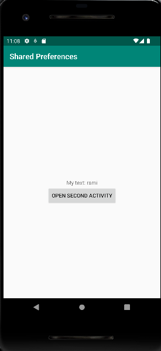
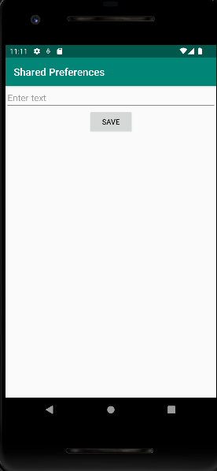
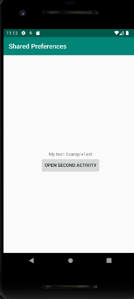

# Rapport

For my Shared Preferences app assignment, I used SharedPreferences 
to make sure data flows smoothly between different screens.
I created a SecondActivity with input fields and a button. The
button saves the text entered above it using SharedPreferences.
MainActivity displays the text saved by retrieving it from
SharedPreferences whenever app is resumed. 

To start the second activity, a method to call on another method 
in the main activity. The first method "onClickView" looks like this:

@Override
public void onClick(View view) {
openSecondActivity();
}

And my openSecondActivity method located in the
main activity looks like this:

private void openSecondActivity() {
Intent secondActivityIntent = new Intent(MainActivity.this, SecondActivity.class);
startActivity(secondActivityIntent);
}

Following are the different stages of the expected usage of the application:

Stage 1
In the picture shown, the application has just been opened and no user input
has been made yet. Visible is a button labled "OPEN SECOND ACTIVITY" which 
opens the second activity. Above it is a text later altered depending on user input.

Stage 2
In the picture shown, the button from the main activity has been pressed. On the top
of the screen, a text field for user input is located. This changes the text located on
the main activity screen. Below the text field is a button to save the changes.

Stage 3
In this final stage, the user has put in "ExampleText" in the text field in the
second activity and pressed the Save button. As a result of this, the text entered
is displayed above the button to open the second activity. From here, the user can
edit the text displayed again by pressing the button on the main activity and repeating
earlier stages.

